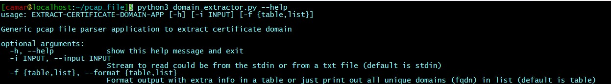
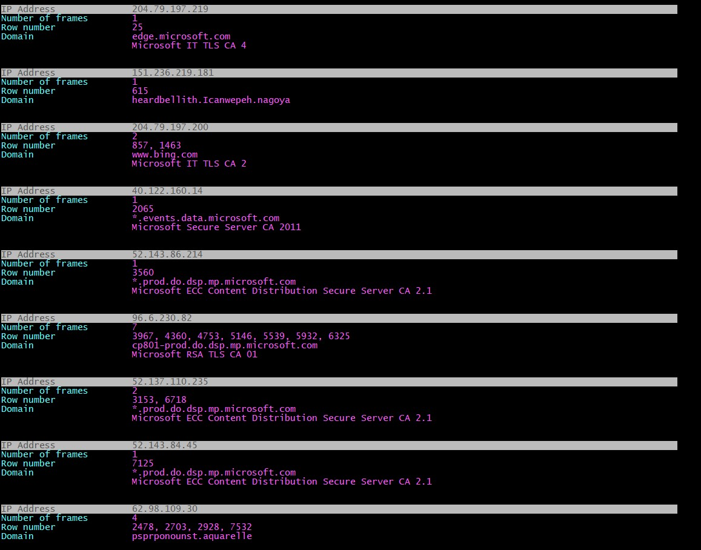
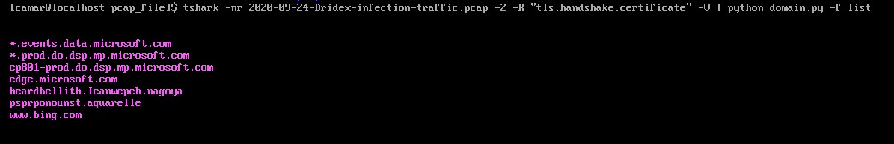

**<h1 align="center"> Welcome to </h1>**
<h1 align="center"><strong> PCAP CERTIFICATE DOMAIN EXTRACTOR PROJECT </strong></h1>

<p align="center">

</p>

<br/>

<p align="center">


<br/>


<p align="justify"> For convenience (ease, speed and free of creation), threat actors have the ability to self-sign their C2 servers certificates. That’s allows them to use randomness or fake values for subject data fields that identifies the server.

In order to detect those bad TLS certificates in HTTPS traffic, this application extracts the domains of digital certificates from a PCAP file for further analysis. That’s could enable us to detect subject data fields with random/fake values and identify indicators of malicious HTTPS traffic.

I had the idea to develop this application during a challenge on the 2022 SANS CTF event, Holiday Hack Challenge (HHC).

<br/>

> The script can ingest the data to be processed in 2 ways:
- From the ***stdin*** (default behavior)

`By piping the tshark command stdout or redirecting text file content to the script's stdin`

```Bash
>>> Piping

$ tshark -nr [pcap filename] -2 -R 'tls.handshake.certificate' -V | python3 domain_extractor.py

>>> Redirection

python3 domain_extractor.py < [text filename]

```

- From a ***text file***</strong>

`With the option --input/-i and providing the text filename`

```Bash
>>> Text file as input

python3 domain_extractor.py --input [text filename]

```

<br/>

> Also, the returned result can be formatted and structured with the option --format/-f and by providing the appropriate arguments:

-	Argument `table` (default) gives nice formatted result with some extra info such as the certificate row number, its frame’s IP, etc.
-	Argument `list` gives just the certificate domain fqdn so we can pipe it, for example, to a VirusTotal domain scanner script
</p>

```Bash
>>> List formatted result

python3 domain_extractor.py --input [text filename] --format list

```

Find complete help with the option/argument --help/-h



<br/>

#
### Usage
#

> Make sure :
* you have Python3 at least
* to make updates beforehand if applicable

<br/>

> Clone the repo with the following from a terminal :

```Bash
$ git clone https://github.com/camarh/domain_extractor
```

<br/>

> From a terminal, run the following command :
- For result formatted in table (default)
```Bash
$ tshark -nr 2020-09-24-Dridex-infection-traffic.pcap -2 -R 'tls.handshake.certificate' -V | python3 domain_extractor.py
```


<br/>

- For result formatted in list
```Bash
$ tshark -nr 2020-09-24-Dridex-infection-traffic.pcap -2 -R 'tls.handshake.certificate' -V | python3 domain_extractor.py -f list
```



<br/>

> PCAP file used to validate and illustrate the script: [Wireshark Tutorial: Examining Dridex Infection Traffic](https://unit42.paloaltonetworks.com/wireshark-tutorial-dridex-infection-traffic/)

> Tips: Large PCAP file may involve some latency. So for faster computation, first save the output of the tshark command to a text file and then compute the script with that text file as data input. Use also `less -R` linux command to page large result so formatting and colors are not lost.

#
### Project Info
# 

<div>Name &nbsp;&nbsp;&nbsp;&nbsp;&nbsp;&nbsp;&nbsp;&nbsp;&nbsp;&nbsp;&nbsp;&nbsp;&nbsp;&nbsp;&nbsp;&nbsp; &nbsp;&nbsp;&nbsp;&nbsp;&nbsp;&nbsp;&nbsp;&nbsp;&nbsp;&nbsp;&nbsp;&nbsp;&nbsp;&nbsp;&nbsp;&nbsp;&nbsp;&nbsp;&nbsp;&nbsp; Creation date&nbsp;&nbsp;&nbsp;&nbsp;&nbsp;&nbsp;&nbsp;&nbsp;&nbsp;&nbsp;&nbsp;&nbsp;&nbsp;&nbsp;&nbsp;&nbsp;&nbsp;&nbsp;&nbsp;&nbsp;Author&nbsp;&nbsp;&nbsp;&nbsp;&nbsp;&nbsp;&nbsp;&nbsp;&nbsp;&nbsp;&nbsp;&nbsp; Programming language</div>

#

<div>domain_extractor.py&nbsp;&nbsp;&nbsp;&nbsp;&nbsp;&nbsp;&nbsp;&nbsp;&nbsp;&nbsp;&nbsp;&nbsp;&nbsp;&nbsp;&nbsp;&nbsp;February 16, 2023&nbsp;&nbsp;&nbsp;&nbsp;&nbsp;&nbsp;&nbsp;&nbsp;&nbsp;&nbsp;&nbsp;&nbsp; Camar H.&nbsp;&nbsp;&nbsp;&nbsp;&nbsp;&nbsp;&nbsp;&nbsp; Python</div>

<br/>

### Feel free to reach me

- Email - &nbsp;&nbsp;&nbsp;&nbsp; <camar.houssein@outlook.com>
- Linkedin - <https://www.linkedin.com/in/camarh/>

#
If you enjoy this project, give it a
[](https://github.com/camarh/domain_extractor/stargazers)


# 

© 2023-2023 Camar H.

# 


